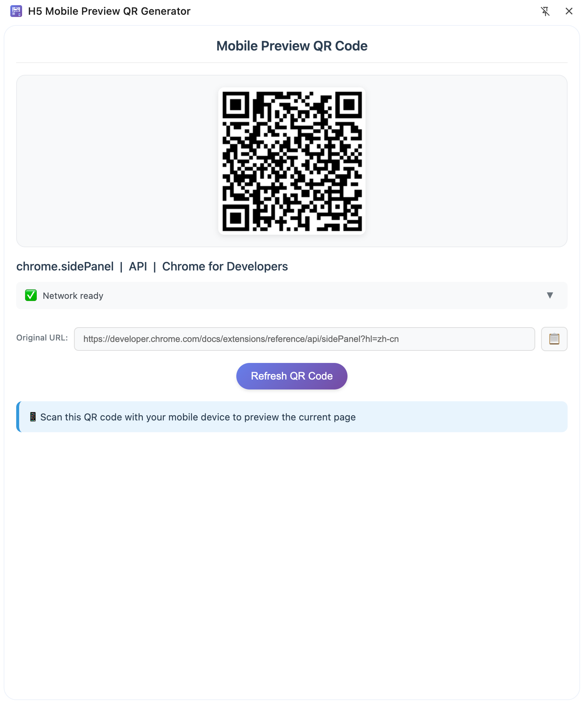

# 很方便的把页面内容生成二维码，扫码即可实时查看的插件



## 功能特性

- 🔄 **一键生成QR码**: 快速生成当前页面的二维码
- 📱 **移动端预览**: 使用手机扫码即可预览当前页面
- 📋 **URL复制**: 一键复制当前页面URL
- 🎨 **精美界面**: 现代化的用户界面设计
- 🔥 **WS热更新**: 支持本地WS热更新监听，自动更新预览码

## 安装和使用

### 1. 安装依赖

```bash
cd chrome-qr-extension
npm install
```

### 2. 构建项目

开发模式（监听文件变化）：
```bash
npm run dev
```

生产模式构建：
```bash
npm run build
```

### 3. 加载Chrome扩展

1. 打开Chrome浏览器，访问 `chrome://extensions/`
2. 开启"开发者模式"
3. 点击"加载已解压的扩展程序"
4. 选择项目的 `chrome-qr-extension` 文件夹
5. 扩展加载成功后会在浏览器工具栏显示图标

### 4. 使用扩展

1. 在需要预览的H5页面上点击扩展图标
2. 扩展会自动生成当前页面的QR码
3. 使用手机扫描QR码即可在移动端预览页面
4. 可以点击"刷新QR码"按钮重新生成
5. 可以点击复制按钮复制页面URL

## 适用场景

- H5移动端组件库开发
- 响应式网页开发测试
- 移动端UI效果预览
- 跨设备页面调试
- 移动端兼容性测试

## 浏览器兼容性

- Chrome 88+
- Edge 88+
- 其他基于Chromium的浏览器

## 许可证

MIT License

## 贡献指南

欢迎提交Issue和Pull Request来帮助改进这个项目！